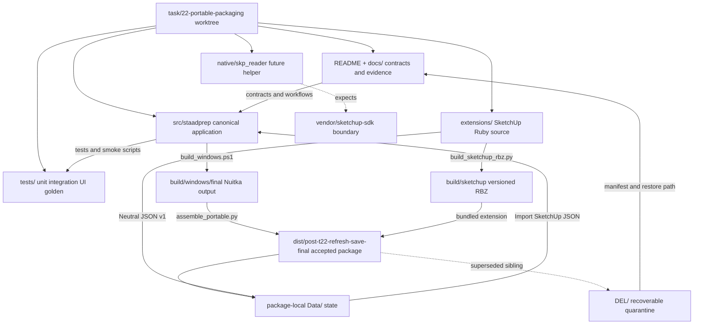
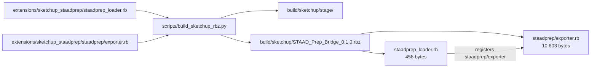
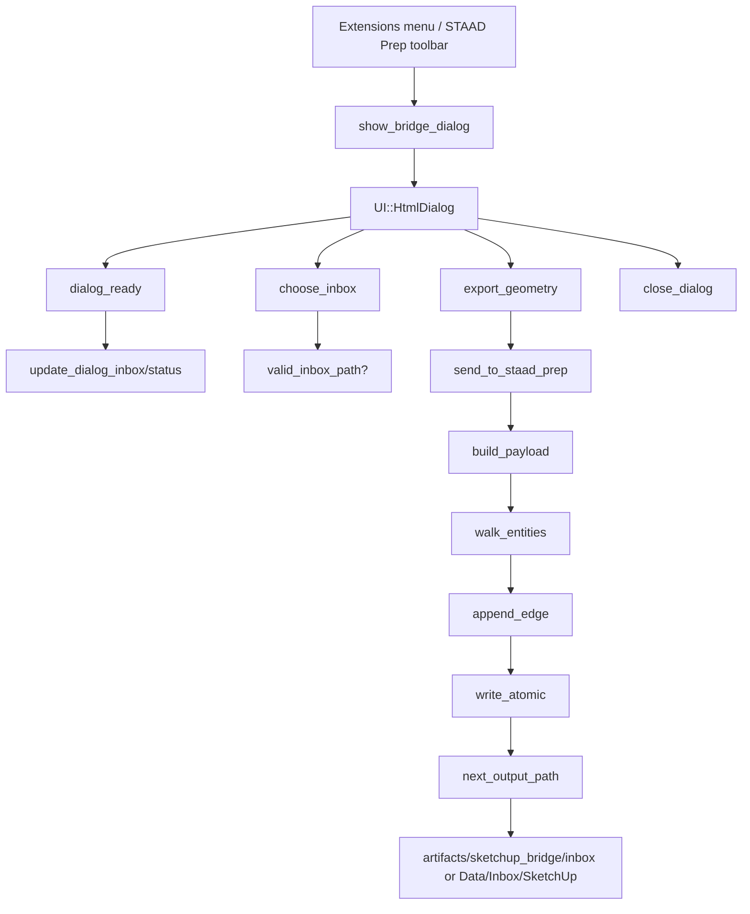

# STAAD Model Preprocessor — Worktree Mindmap

Status: **ACTIVE POST-T26 STORAGE CLEANUP MAP**
Generated: 2026-09-01
Branch: `task/22-portable-packaging`
T24 checkpoint: `chore: quarantine unused project files for review`
Canonical root: `D:\Dizayn59\CLICodex\gpt_mcp_workshop\STAAD_Model_Preprocessor`
Active worktree: `D:\Dizayn59\CLICodex\gpt_mcp_workshop\STAAD_Model_Preprocessor\.worktrees\task-22-portable-packaging`

This is the canonical navigation map for future patches. It distinguishes source-of-truth code,
generated output, accepted release artifacts, historical evidence, and quarantined files. Tracked
files are listed individually in the catalog. Volatile ignored directories are represented by stable
group rules and T25/T26 audit counts.

## 1. Lifecycle and task status

| Area | State | Evidence |
|---|---|---|
| T01–T21 | Complete | master plan and historical checkpoints |
| T22 portable standalone packaging | Complete | `dist/post-t22-refresh-save-final/` |
| T23 real-project / STAAD.Pro acceptance | Pass by user report | `docs/HANDOFF.md`, 2026-09-01 |
| T24 cleanup | Complete | `DEL/UNUSED_FILES_MANIFEST.md` and final audit |
| T25 storage audit | Move complete; space deletion pending user | `DEL/UNUSED_FILES_MANIFEST.md`, `artifacts/cleanup/storage-audit-20260901.md` |
| T26 storage cleanup | Move + standalone smoke verified; space deletion pending user | `DEL/t26-storage-cleanup-20260901/` |
| Post-T26 mindmap | Active/current | this document |

T24 performed one recoverable move only:

```text
dist/post-t22-editing-final/
  -> DEL/t24-quarantine-20260901/dist/post-t22-editing-final/
     814 files, 933,569,500 bytes
```

The accepted current release remains `dist/post-t22-refresh-save-final/` with 813 files and
933,750,946 bytes. Its ZIP SHA-256 is
`0EF7933499179284B7FC01B011876BF196F7471D4F8CA5B7B12F46E36059E314`; its executable SHA-256 is
`1C7BB68D12BEFA8A1DBDC5A8A18B031A1E19AEFCFB91C7567441E79DB88F4470`.

T25 moved the approved old package and five superseded/failed build attempts to
`DEL/t25-storage-audit-20260901/`. That quarantine later had its contents removed by the user;
the original six paths are absent and no live references to their old names remain. Post-move
`build/` is 5,522 files / 2,269,062,384 bytes and `artifacts/` is 6 files / 155,022 bytes.

## 2. Main relationship map



## 3. End-to-end data flow

```text
SketchUp Ruby Bridge or Direct DXF
  -> RawPoint / RawSegment / ImportBatch
  -> units.transforms (source unit/axis -> metre/Y-Up)
  -> topology.builder (coincident registry -> Node/Member graph)
  -> validators / connected structures / ReadyGate
  -> repair/edit commands + RepairHistory + audit
  -> orientation/local-X normalization
  -> deterministic numbering
  -> validated STAAD .STD + report
  -> STAAD.Pro acceptance
```

The canonical model is the only source of truth. The VTK viewport emits intent and previews; it does
not own topology or permanently mutate geometry. Model mutations pass through reversible commands.

## 4. Python source map

### Application and runtime

| File | Role | Main edges |
|---|---|---|
| `src/staadprep/app.py` | PySide6 entrypoint | `MainWindow`, paths, demo, viewport, packaged smoke |
| `src/staadprep/version.py` | canonical version `0.1.0` | RBZ builder, Windows build, package manifest |
| `src/staadprep/paths.py` | development path service | `.tmp`, `.cache`, `.logs`, `artifacts`, `build`, `dist`, `vendor` |
| `src/staadprep/portable_paths.py` | compiled portable path service | executable-root `Data/` hierarchy and environment |
| `src/staadprep/packaged_smoke.py` | packaged workflow driver | UI import/edit/READY/export smoke |
| `src/staadprep/__init__.py` | package marker | package boundary |

Portable runtime paths are `Data/Config`, `Data/Projects`, `Data/Inbox/SketchUp`, `Data/Exports`,
`Data/Reports`, `Data/Logs`, `Data/Cache`, `Data/Temp`, and `Data/Backups`. Development paths use
`artifacts/projects` and `artifacts/sketchup_bridge/inbox`.

### Canonical model

| File | Role | Consumers |
|---|---|---|
| `src/staadprep/model/entities.py` | Node/Member with stable UUID identity | all graph operations |
| `src/staadprep/model/geometry.py` | Vec3 and geometry primitives | import, inference, viewer, export |
| `src/staadprep/model/project.py` | ProjectModel and ModelMetadata | application source of truth |
| `src/staadprep/model/serialization.py` | schema-v1 Project JSON and atomic save | Save/Open and package runtime |
| `src/staadprep/model/__init__.py` | model package boundary | imports |

UUIDs are internal canonical identity. STAAD numbers are mutable attributes used for display/export;
member endpoint UUID references must remain valid through edits and renumbering.

### Import, units, and topology

| File | Role | Downstream |
|---|---|---|
| `src/staadprep/importers/contracts.py` | RawPoint/RawSegment/ImportBatch contract | all import adapters |
| `src/staadprep/importers/dxf_reader.py` | Direct DXF line reader | shared import pipeline |
| `src/staadprep/importers/neutral_reader.py` | strict SketchUp Neutral JSON v1 reader | shared import pipeline |
| `src/staadprep/importers/skp_bridge.py` | optional native helper process contract | future `.skp` path |
| `src/staadprep/importers/raw_preview.py` | raw DXF preview conversion | preview UI |
| `src/staadprep/importers/pipeline.py` | raw -> transform -> topology orchestration | canonical model |
| `src/staadprep/importers/__init__.py` | importer package boundary | imports |
| `src/staadprep/units/transforms.py` | length conversion and Z-Up -> Y-Up | import pipeline; STRICT HR-1/HR-2 |
| `src/staadprep/units/__init__.py` | units package boundary | imports |
| `src/staadprep/topology/builder.py` | deterministic endpoint registry/incidence | ProjectModel |
| `src/staadprep/topology/connectivity.py` | connected components/structures | validation and summary |
| `src/staadprep/topology/__init__.py` | topology package boundary | imports |

### Validation, repair, editing

| File | Role | Downstream |
|---|---|---|
| `src/staadprep/validation/issues.py` | issue types/severity/location | validators, console, quick fix |
| `src/staadprep/validation/validators.py` | non-mutating geometry/topology checks | ReadyGate and issue UI |
| `src/staadprep/validation/ready_gate.py` | authoritative READY policy/status | export and UI |
| `src/staadprep/validation/__init__.py` | validation package boundary | imports |
| `src/staadprep/repair/commands.py` | reversible graph/coordinate commands | all mutations |
| `src/staadprep/repair/composite.py` | atomic multi-command transaction | repeat, auto-fix-all, compound edits |
| `src/staadprep/repair/history.py` | undo/redo and revision tracking | UI and audit |
| `src/staadprep/repair/audit.py` | validation/audit report writer | acceptance evidence |
| `src/staadprep/repair/__init__.py` | repair package boundary | imports |
| `src/staadprep/editing/create_node.py` | exact/relative/repeat specs/proposals | create dialogs and viewport |
| `src/staadprep/editing/inference.py` | snap/intersection/axis-lock inference | ghost preview |
| `src/staadprep/editing/manual_ops.py` | UI intent -> commands/composites | viewport and MainWindow |
| `src/staadprep/editing/__init__.py` | editing package boundary | imports |

### Orientation, numbering, and export

| File | Role | Downstream |
|---|---|---|
| `src/staadprep/orientation/normalize.py` | deterministic member direction classification | reverse commands and export readiness |
| `src/staadprep/orientation/local_axes.py` | member local-X vectors | viewport arrows and Properties |
| `src/staadprep/orientation/commands.py` | Auto Fix, Flip, Set Direction builders | UI and history |
| `src/staadprep/orientation/__init__.py` | orientation package boundary | imports |
| `src/staadprep/numbering/renumber.py` | deterministic node/member order and map | numbering commands and export |
| `src/staadprep/numbering/commands.py` | reversible numbering wrappers | UI preview/apply/undo |
| `src/staadprep/numbering/__init__.py` | numbering package boundary | imports |
| `src/staadprep/exporters/staad_std.py` | validated minimal STAAD SPACE geometry exporter | `.STD`, report, HR-4 boundary |
| `src/staadprep/exporters/__init__.py` | exporter package boundary | imports |

### Viewer and UI

| File | Role | Downstream |
|---|---|---|
| `src/staadprep/viewer/scene.py` | render-ready scene data | VTK widget |
| `src/staadprep/viewer/selection.py` | candidate/filter/UUID selection state | picking, Explorer, Properties |
| `src/staadprep/viewer/interaction.py` | edit/navigation mode state machine | mouse, keyboard, context menu |
| `src/staadprep/viewer/palette.py` | viewport/highlight colors | widget |
| `src/staadprep/viewer/widget.py` | PyVista/VTK rendering, picking, highlights, camera, previews | editing commands and MainWindow signals |
| `src/staadprep/viewer/demo.py` | deterministic demo frame | app startup and UI smoke |
| `src/staadprep/viewer/__init__.py` | viewer package boundary | imports |
| `src/staadprep/ui/main_window.py` | authoritative UI orchestration | import, selection, Properties, dialogs, history, Save/Open, exit |
| `src/staadprep/ui/panels.py` | Explorer, Properties, summary, validation, quick-fix panels | MainWindow |
| `src/staadprep/ui/issue_console.py` | issue table/filter/actions | validators and repair |
| `src/staadprep/ui/model_controls.py` | toolbar/ribbon and enabled-state wiring | modes, numbering, direction, view |
| `src/staadprep/ui/create_node_dialog.py` | exact/relative/repeat/member-repeat dialogs | editing specs/proposals |
| `src/staadprep/ui/repair_apply_dialog.py` | Apply-before-OK contract | destructive actions and refresh |
| `src/staadprep/ui/theme.py` | dark engineering desktop stylesheet | app and dialogs |
| `src/staadprep/ui/__init__.py` | UI package boundary | imports |

## 5. SketchUp RBZ deep map

The current RBZ is a deterministic ZIP archive with exactly two members. There are no external
HTML/CSS/JS assets; the HtmlDialog UI is embedded in `exporter.rb`.



| RBZ member | Source mapping | Runtime role | Build/source contract | Future patch point |
|---|---|---|---|---|
| `staadprep_loader.rb` (458 bytes) | `extensions/sketchup_staadprep/staadprep_loader.rb` | requires SketchUp APIs, creates and registers `SketchupExtension` | copied byte-for-byte after `EXTENSION.version == __version__` | metadata, registration, version |
| `staadprep/exporter.rb` (10,603 bytes) | `extensions/sketchup_staadprep/staadprep/exporter.rb` | command, toolbar, HtmlDialog, inbox, traversal, JSON, atomic write | copied byte-for-byte; loader path must resolve member | callbacks, schema, traversal, paths |

### 5.1 RBZ build and loader flow

```text
src/staadprep/version.py
  -> build_sketchup_rbz.py reads __version__ = 0.1.0
  -> validates EXTENSION.version in loader
  -> stages only build/sketchup/stage/
  -> writes sorted fixed-timestamp ZIP
  -> build/sketchup/STAAD_Prep_Bridge_0.1.0.rbz
  -> SketchUp loads staadprep_loader.rb
  -> SketchupExtension.new('STAAD Prep Bridge', 'staadprep/exporter')
  -> SketchUp resolves staadprep/exporter.rb
```

The loader has no geometry logic. `file_loaded(__FILE__)` in the exporter prevents duplicate menu
and toolbar registration on reload.

### 5.2 RBZ UI/callback map



| UI action | Callback | Effect |
|---|---|---|
| `Export Geometry` | `export_geometry` | build/write payload, update status, show result |
| `Choose Inbox...` | `choose_inbox` | validate suffix and persist SketchUp preference |
| `Close` | `close_dialog` | close dialog and clear cached instance |
| page load | `dialog_ready` | display inbox and ready status |

### 5.3 Geometry traversal and JSON contract

```text
Sketchup.active_model.entities
  -> walk_entities(entities, parent_transform, group_path, component_path, ref_path, ...)
     -> Edge: append_edge(world start/end, tag, persistent-id source_ref)
     -> Group: multiply transformation, extend group_path/ref_path
     -> ComponentInstance: multiply transformation, walk definition.entities
  -> build_payload
  -> write_atomic
```

| Field | Contract |
|---|---|
| `protocol_version` | integer `1` |
| `source_file` | saved model path, or title/`Untitled.skp` fallback with warning |
| `source_unit` | `in`; SketchUp API coordinates are internal inches |
| `source_axis` | `Z-UP` |
| `points` | currently empty array from Ruby exporter; Python accepts it |
| `segments` | edge start/end, `source_ref`, tag, group path, component path |
| `groups` / `tags` | unique names/layers |
| `warnings` | transport warnings |
| `model_length_unit` | SketchUp UnitsOptions value |

The RBZ does not convert axes, merge endpoints, repair topology, number nodes, export `.STD`, or
perform analysis. Python starts the engineering semantics after transport.

### 5.4 Output path and Python handoff

```text
configured_inbox or Choose Inbox...
  -> suffix must end with artifacts/sketchup_bridge/inbox or Data/Inbox/SketchUp
  -> mkdir_p
  -> SP_YYYYMMDD_HHMMSS.json; collision suffix _02, _03, ...
  -> write .json.tmp, flush, fsync, rename atomically
  -> MainWindow import route
  -> NeutralReader protocol-v1 validation and inbox boundary
  -> ImportBatch(source_format=skp, source_unit=in, source_axis=Z-UP)
  -> transform_batch (in/Z-UP -> metre/Y-UP)
  -> build_project (Node/Member incidence)
```

RBZ evidence files:

- `tests/unit/test_sketchup_ruby_contract.py` checks source strings, forbidden coupling, both inbox paths, and export semantics.
- `tests/unit/test_version_contract.py` checks Ruby loader version against Python version.
- `tests/integration/test_rbz_package.py` checks exact archive members, version, and project-local staging.
- `tests/integration/test_sketchup_ruby_pipeline.py` checks Neutral JSON through the shared pipeline.
- `tests/integration/test_package_manifest.py` checks RBZ bundling into the folder/ZIP/manifest.

## 6. Native SketchUp boundary

| File/path | Role | Lifecycle |
|---|---|---|
| `native/skp_reader/CMakeLists.txt` | CMake scaffold expecting `vendor/sketchup-sdk` | protected future boundary |
| `native/skp_reader/include/neutral_contract.h` | native capability/neutral contract | protected |
| `native/skp_reader/src/main.cpp` | helper entrypoint scaffold | protected; not a V1 runtime dependency |
| `vendor/sketchup-sdk/` | official SDK location if enabled later | protected |

`SkpBridge` invokes a helper process and validates neutral JSON without exposing SDK types to the
rest of the application. DXF and the Ruby bridge remain usable if the native helper is unavailable.

## 7. Build, package, and runtime relationship

This section maps the build and runtime layers.

~~~mermaid
flowchart LR
    PYPROJECT[pyproject.toml] --> SRC[src/staadprep]
    SRC --> DEV[python -m staadprep.app]
    DEV --> DEVPATH[project-local writable paths]
    PS[scripts/build_windows.ps1] --> NUITKA[Nuitka standalone build]
    NUITKA --> WINBUILD[build/windows/final]
    WINBUILD --> ASSEMBLE[scripts/assemble_portable.py]
    RBZBUILD[scripts/build_sketchup_rbz.py] --> RBZ[build/sketchup/STAAD_Prep_Bridge_0.1.0.rbz]
    ASSEMBLE --> PACKAGE[dist/post-t22-refresh-save-final]
    RBZ --> PACKAGE
    PACKAGE --> MANIFEST[package-manifest.json + SHA-256]
    PACKAGE --> ZIP[portable ZIP]
    PACKAGE --> ACCEPT[packaged smoke / user acceptance]
~~~

### 7.1 Runtime path layers

| Layer | Entry or owner | Responsibility | Must remain stable for |
|---|---|---|---|
| Development entry | src/staadprep/app.py | launch Qt application from source | local development and UI tests |
| Path policy | src/staadprep/paths.py and portable_paths.py | resolve project-local and portable writable roots | relocation and no-CWD behavior |
| Windows build | scripts/build_windows.ps1 | invoke the approved Nuitka build contract | reproducible executable creation |
| Portable assembly | scripts/assemble_portable.py | copy runtime, data, RBZ, manifest and hashes | package layout and installer-free distribution |
| Runtime smoke | src/staadprep/packaged_smoke.py | verify packaged imports/paths | post-build acceptance |
| Current release | dist/post-t22-refresh-save-final/ | accepted folder package | user testing |
| Current release archive | current T22 ZIP artifact | transportable package copy | handoff and checksum verification |

### 7.2 Portable package contract

~~~text
STAAD_Model_Preprocessor_0.1.0_win64_portable/
├── STAAD Model Preprocessor.exe
├── Data/
│   ├── Inbox/SketchUp/
│   ├── Outbox/
│   └── ... runtime data roots ...
├── SketchUp_Extension/
│   └── STAAD_Prep_Bridge_0.1.0.rbz
├── package-manifest.json
└── package-manifest.sha256
~~~

The package is deliberately a folder plus ZIP distribution. It is not an installer, MSI, NSIS
bundle, automatic updater, or one-file production executable. The executable remains dependent on
the adjacent Data/ tree and the package contract; copying only the .exe is not the supported V1
distribution model.

### 7.3 Release evidence

| Evidence | Current value |
|---|---|
| accepted folder | dist/post-t22-refresh-save-final/ |
| folder inventory | 813 files, 933,750,946 bytes |
| executable SHA-256 | 1C7BB68D12BEFA8A1DBDC5A8A18B031A1E19AEFCFB91C7567441E79DB88F4470 |
| ZIP SHA-256 | 0EF7933499179284B7FC01B011876BF196F7471D4F8CA5B7B12F46E36059E314 |
| package version | 0.1.0 |
| accepted validation | T22 package verification and T23 user acceptance passed |

## 8. Verification and test map

~~~mermaid
flowchart TD
    MODEL[Model entities / geometry] --> UNIT[unit tests]
    IMPORT[DXF / neutral / SketchUp import] --> INT[import integration tests]
    EDIT[manual edit / repair / topology] --> EDITTEST[edit and repair tests]
    VIEW[viewer / Qt UI] --> UITEST[UI tests and isolated smoke]
    RBZ[RBZ source and archive] --> RBZTEST[contract + package tests]
    PACKAGE[portable package] --> PACKTEST[paths + manifest + workflow tests]
    UNIT --> REGRESSION[regression evidence]
    INT --> REGRESSION
    EDITTEST --> REGRESSION
    UITEST --> REGRESSION
    RBZTEST --> REGRESSION
    PACKTEST --> REGRESSION
~~~

### 8.1 Verification levels used

| Area | Risk level | Evidence expected | Current state |
|---|---|---|---|
| UI wording/layout | FAST | affected smoke | completed where applicable |
| normal model/import/UI behavior | STANDARD | targeted tests, lint/type-check, affected build | source regression 303/303 previously passed |
| topology, coordinate transforms, repair, STD semantics | STRICT gate | explicit approval, independent checks, regression | no new analytical feature added by mindmap |
| packaging/path/manifest | STANDARD with package smoke | package tests, hashes, relocation checks | T22/T23 accepted |
| T24 file quarantine | controlled move | inventory, reference scan, package regression | complete; no deletion |
| mindmap/documentation | FAST | link/path/content self-check and diff check | complete pending checkpoint commit |

### 8.2 Tracked test catalog

#### Integration tests

- tests/integration/test_canonical_topology_pipeline.py — canonical topology and pipeline behavior.
- tests/integration/test_dxf_reader.py — DXF reader integration.
- tests/integration/test_full_pipeline.py — end-to-end source pipeline.
- tests/integration/test_package_manifest.py — package manifest, hashes, RBZ inclusion.
- tests/integration/test_packaged_paths.py — portable path and relocation contract.
- tests/integration/test_packaged_workflow_smoke.py — packaged workflow smoke.
- tests/integration/test_raw_dxf_preview.py — raw DXF preview path.
- tests/integration/test_rbz_package.py — exact RBZ package members and version.
- tests/integration/test_sketchup_ruby_pipeline.py — neutral JSON through shared pipeline.

#### UI tests

- tests/ui/conftest.py — Qt/UI fixtures and test setup.
- tests/ui/test_create_node_dialog.py — precision node dialog.
- tests/ui/test_dxf_import_flow.py — DXF import UI flow.
- tests/ui/test_exit_confirmation.py — close confirmation behavior.
- tests/ui/test_export_ui.py — export UI behavior.
- tests/ui/test_import_routes.py — import route selection.
- tests/ui/test_inference_viewport.py — viewport inference interaction.
- tests/ui/test_issue_console.py — issue console display.
- tests/ui/test_issue_repair_smoke.py — issue/repair UI smoke.
- tests/ui/test_main_window.py — main window contract.
- tests/ui/test_manual_edit_mouse.py — mouse editing interaction.
- tests/ui/test_manual_edit_real_smoke.py — real manual-edit smoke.
- tests/ui/test_manual_edit_smoke.py — manual-edit smoke.
- tests/ui/test_manual_edit_ui.py — manual-edit UI actions.
- tests/ui/test_model_controls.py — model control behavior.
- tests/ui/test_orientation_smoke.py — orientation smoke.
- tests/ui/test_orientation_ui.py — orientation UI.
- tests/ui/test_precision_create_integration.py — precision create integration.
- tests/ui/test_precision_create_real_smoke.py — precision create real smoke.
- tests/ui/test_precision_dialog_signals.py — precision dialog signals.
- tests/ui/test_precision_mouse.py — precision mouse behavior.
- tests/ui/test_precision_viewport.py — precision viewport behavior.
- tests/ui/test_precision_viewport_collision_preview.py — collision preview.
- tests/ui/test_project_explorer_selection.py — project explorer selection.
- tests/ui/test_project_save_ui.py — JSON save UI.
- tests/ui/test_ready_gate_ui.py — READY gate UI.
- tests/ui/test_repair_apply_dialog.py — repair apply dialog.
- tests/ui/test_repair_apply_refresh.py — repair refresh behavior.
- tests/ui/test_repair_apply_refresh_vtk.py — VTK repair refresh.
- tests/ui/test_selection_properties.py — selected entity properties.
- tests/ui/test_set_direction_viewport.py — direction tool viewport.
- tests/ui/test_skp_capability_ui.py — SketchUp capability UI.
- tests/ui/test_structural_viewport.py — structural viewport.
- tests/ui/test_translational_repeat_dialog.py — translational repeat dialog.
- tests/ui/test_viewport_context_menu.py — viewport context menu.
- tests/ui/test_viewport_navigation.py — navigation/reset/camera behavior.

#### Unit tests

- tests/unit/test_app_runtime_paths.py — runtime path initialization.
- tests/unit/test_axis_lock.py — axis locking.
- tests/unit/test_composite_repair.py — composite repair command.
- tests/unit/test_connectivity.py — connectivity rules.
- tests/unit/test_create_node_atomic.py — atomic node creation.
- tests/unit/test_create_node_specs.py — create-node specifications.
- tests/unit/test_delete_selection.py — selection deletion.
- tests/unit/test_global_axis_indicator.py — global axis indicator.
- tests/unit/test_import_batch_axis_contract.py — import axis contract.
- tests/unit/test_import_pipeline.py — import pipeline.
- tests/unit/test_inference.py — inference basics.
- tests/unit/test_inference_advanced.py — advanced inference.
- tests/unit/test_inference_independent_check.py — independent inference check.
- tests/unit/test_interaction_state.py — interaction state machine.
- tests/unit/test_manual_edit_commands.py — manual edit commands.
- tests/unit/test_manual_edit_roundtrip.py — edit roundtrip.
- tests/unit/test_manual_split_ops.py — split operations.
- tests/unit/test_member_local_axes.py — member local axes.
- tests/unit/test_member_translational_repeat.py — member repeat.
- tests/unit/test_merge_members.py — member merge.
- tests/unit/test_model.py — model entities/invariants.
- tests/unit/test_model_controls_invariants.py — control invariants.
- tests/unit/test_neutral_reader.py — neutral reader.
- tests/unit/test_numbering_commands.py — numbering commands.
- tests/unit/test_numbering_policy.py — numbering policy.
- tests/unit/test_orientation.py — orientation normalization.
- tests/unit/test_orientation_commands.py — orientation commands.
- tests/unit/test_orientation_invariants.py — orientation invariants.
- tests/unit/test_paths.py — path service.
- tests/unit/test_portable_paths.py — portable path service.
- tests/unit/test_ready_gate.py — readiness gate.
- tests/unit/test_renumber.py — renumbering.
- tests/unit/test_renumber_edges.py — renumber edge cases.
- tests/unit/test_repair_commands.py — repair commands.
- tests/unit/test_repair_edges.py — repair edge cases.
- tests/unit/test_repair_history.py — repair history.
- tests/unit/test_scene_data.py — scene data.
- tests/unit/test_scene_inference_data.py — scene inference data.
- tests/unit/test_scene_orientation.py — scene orientation.
- tests/unit/test_selection_cycle.py — selection cycling.
- tests/unit/test_serialization.py — serialization.
- tests/unit/test_sketchup_ruby_contract.py — RBZ source contract.
- tests/unit/test_skp_bridge.py — SketchUp bridge.
- tests/unit/test_skp_native_scaffold.py — native scaffold.
- tests/unit/test_staad_exporter.py — STAAD exporter.
- tests/unit/test_topology_builder.py — topology builder.
- tests/unit/test_translational_repeat.py — translational repeat.
- tests/unit/test_translational_repeat_preview_counts.py — repeat preview counts.
- tests/unit/test_translational_repeat_roundtrip.py — repeat roundtrip.
- tests/unit/test_ui_isolated_runner.py — isolated UI runner.
- tests/unit/test_units_transforms.py — unit transforms.
- tests/unit/test_validation_edges.py — validation edge cases.
- tests/unit/test_validation_report.py — validation report.
- tests/unit/test_validators.py — validators.
- tests/unit/test_version_contract.py — Python/Ruby version contract.
- tests/unit/test_viewer_palette.py — viewer palette.
- tests/unit/test_viewport_camera_contract.py — camera contract.
- tests/unit/test_viewport_display_coordinates.py — display coordinates.
- tests/unit/test_windows_build_contract.py — Windows build contract.

#### Golden fixtures and expected outputs

- tests/conftest.py — shared test fixtures.
- tests/golden_models/01_clean_frame/case.json and tests/golden_models/01_clean_frame/expected.std — clean frame baseline.
- tests/golden_models/01_dxf_lines/source.dxf — DXF source baseline.
- tests/golden_models/02_orphan_node/case.json — orphan-node validation case.
- tests/golden_models/03_near_nodes/case.json — near-node case.
- tests/golden_models/04_duplicate_member/case.json — duplicate-member case.
- tests/golden_models/05_short_member/case.json — short-member case.
- tests/golden_models/06_disconnected_structures/case.json — disconnected structures case.
- tests/golden_models/07_wrong_scale/case.json — scale case.
- tests/golden_models/08_wrong_axis/case.json — axis case.
- tests/golden_models/09_crossing_without_node/case.json — crossing-without-node case.
- tests/golden_models/10_combined_dirty_frame/case.json — combined dirty model.
- tests/golden_models/10_combined_dirty_frame/expected_manual_clean.json — manual clean result.
- tests/golden_models/11_sketchup_ruby_simple_frame/expected.json — SketchUp bridge result.

## 9. Tracked file catalog

This catalog is intentionally explicit. It describes the versioned source of truth; generated
outputs are documented separately in Section 10.

### 9.1 Root and policy

- .gitignore — excludes generated/cache/runtime material from version control.
- .tmp/.gitkeep — keeps the project-local temporary root available.
- AGENTS.md — project development, risk, path, and documentation policy.
- DEL/UNUSED_FILES_MANIFEST.md — T24 quarantine manifest and recoverability record.
- README.md — user-facing project overview and current status.
- pyproject.toml — Python package metadata, dependencies, tools, and test configuration.

### 9.2 Core documentation

- docs/ARCHITECTURE.md — architecture and subsystem boundaries.
- docs/CHECKLIST.md — acceptance and release checklist.
- docs/HANDOFF.md — current handoff, blockers, evidence, and next actions.
- docs/INDEX.md — documentation entrypoint and navigation map.
- docs/PROJECT_RULES.md — project-specific rules and constraints.
- docs/PROJECT_SPEC.md — product scope and behavioral specification.
- docs/RISK_GATES.md — high-risk approval and verification gates.
- docs/TASK_BOARD.md — task lifecycle and remaining work.
- docs/UI_BASELINE.md — approved dark engineering UI baseline.
- docs/WORKFLOW.md — import/edit/validate/export workflow.
- docs/WORKTREE_MINDMAP.md — this cross-file relationship and status map.
- docs/ui/issue_repair.svg — issue/repair UI reference.
- docs/ui/main_dashboard.svg — main dashboard UI reference.
- docs/ui/unit_check.svg — unit-check UI reference.

### 9.3 Plans and specifications

- docs/superpowers/plans/2026-08-28-manual-model-editing-v1.md — manual editing plan.
- docs/superpowers/plans/2026-08-28-staad-model-preprocessor-v1.md — original V1 plan.
- docs/superpowers/plans/2026-08-29-t22-portable-standalone-packaging.md — T22 packaging plan.
- docs/superpowers/plans/2026-08-30-desktop-interaction-usability.md — desktop interaction plan.
- docs/superpowers/plans/2026-08-30-post-t22-editing-corrections.md — editing corrections plan.
- docs/superpowers/plans/2026-08-30-sketchup-bridge-usability.md — SketchUp bridge usability plan.
- docs/superpowers/plans/2026-08-31-post-t22-refresh-properties-save.md — refresh/properties/save plan.
- docs/superpowers/plans/2026-08-31-project-explorer-entity-selection.md — explorer selection plan.
- docs/superpowers/plans/2026-09-01-worktree-mindmap.md — plan for this mindmap.
- docs/superpowers/specs/2026-08-28-manual-model-editing-design.md — manual editing design.
- docs/superpowers/specs/2026-08-28-sketchup-ruby-bridge-design.md — Ruby bridge design.
- docs/superpowers/specs/2026-08-28-staad-model-preprocessor-design.md — V1 design.
- docs/superpowers/specs/2026-08-30-post-t22-editing-corrections-design.md — corrections design.
- docs/superpowers/specs/2026-08-30-post-t22-usability-design.md — usability design.
- docs/superpowers/specs/2026-08-31-post-t22-refresh-properties-save-design.md — refresh/properties/save design.
- docs/superpowers/specs/2026-08-31-project-explorer-entity-selection-design.md — explorer selection design.

### 9.4 Bridge, native boundary, packaging, and scripts

- extensions/sketchup_staadprep/staadprep/exporter.rb — SketchUp geometry exporter source.
- extensions/sketchup_staadprep/staadprep_loader.rb — SketchUp extension loader source.
- native/skp_reader/CMakeLists.txt — optional native reader scaffold.
- native/skp_reader/include/neutral_contract.h — native neutral contract.
- native/skp_reader/src/main.cpp — native helper scaffold entrypoint.
- packaging/INSTALL_RBZ.md — RBZ installation instructions.
- packaging/README_PORTABLE.md — portable package instructions.
- packaging/UPDATE_MANUAL.md — manual update instructions.
- scripts/assemble_portable.py — portable folder/ZIP assembly.
- scripts/build_sketchup_rbz.py — deterministic RBZ builder.
- scripts/build_windows.ps1 — Windows/Nuitka build contract.
- scripts/run_dev.ps1 — source development launcher.
- scripts/smoke_dxf_preview.py — DXF preview smoke helper.
- scripts/smoke_issue_repair.py — issue repair smoke helper.
- scripts/smoke_manual_edit.py — manual edit smoke helper.
- scripts/smoke_orientation.py — orientation smoke helper.
- scripts/smoke_precision_create.py — precision create smoke helper.
- scripts/smoke_viewport.py — viewport smoke helper.
- scripts/test_ui_isolated.ps1 — isolated UI test launcher.
- scripts/test_ui_isolated.py — isolated UI test runner.

### 9.5 Python source catalog

#### Application and runtime

- src/staadprep/__init__.py — package identity/export surface.
- src/staadprep/app.py — Qt application composition and main entry.
- src/staadprep/packaged_smoke.py — packaged runtime smoke entry.
- src/staadprep/paths.py — canonical development path service.
- src/staadprep/portable_paths.py — portable package path service.
- src/staadprep/version.py — single version contract.

#### Editing

- src/staadprep/editing/__init__.py — editing package surface.
- src/staadprep/editing/create_node.py — create-node command logic.
- src/staadprep/editing/inference.py — viewport/node inference.
- src/staadprep/editing/manual_ops.py — manual create/delete/split/merge/repeat operations.

#### Exporters

- src/staadprep/exporters/__init__.py — exporter package surface.
- src/staadprep/exporters/staad_std.py — STAAD .STD serialization.

#### Importers

- src/staadprep/importers/__init__.py — importer package surface.
- src/staadprep/importers/contracts.py — neutral import contracts.
- src/staadprep/importers/dxf_reader.py — DXF reader.
- src/staadprep/importers/neutral_reader.py — neutral JSON reader.
- src/staadprep/importers/pipeline.py — import/transform/build pipeline.
- src/staadprep/importers/raw_preview.py — raw source preview.
- src/staadprep/importers/skp_bridge.py — SketchUp bridge process/JSON boundary.

#### Model

- src/staadprep/model/__init__.py — model package surface.
- src/staadprep/model/entities.py — Node, Member, and model entities.
- src/staadprep/model/geometry.py — points, vectors, and geometric primitives.
- src/staadprep/model/project.py — project aggregate and mutation boundary.
- src/staadprep/model/serialization.py — project JSON serialization.

#### Numbering

- src/staadprep/numbering/__init__.py — numbering package surface.
- src/staadprep/numbering/commands.py — numbering command wrappers.
- src/staadprep/numbering/renumber.py — numbering policies and renumber implementation.

#### Orientation

- src/staadprep/orientation/__init__.py — orientation package surface.
- src/staadprep/orientation/commands.py — orientation command wrappers.
- src/staadprep/orientation/local_axes.py — local-axis calculations.
- src/staadprep/orientation/normalize.py — orientation normalization.

#### Repair

- src/staadprep/repair/__init__.py — repair package surface.
- src/staadprep/repair/audit.py — repair/audit records.
- src/staadprep/repair/commands.py — explicit repair commands.
- src/staadprep/repair/composite.py — grouped repair commands.
- src/staadprep/repair/history.py — undo/redo history.

#### Topology, units, and validation

- src/staadprep/topology/__init__.py — topology package surface.
- src/staadprep/topology/builder.py — node/member topology construction.
- src/staadprep/topology/connectivity.py — connectivity queries/invariants.
- src/staadprep/units/__init__.py — units package surface.
- src/staadprep/units/transforms.py — unit/axis transforms.
- src/staadprep/validation/__init__.py — validation package surface.
- src/staadprep/validation/issues.py — validation issue model.
- src/staadprep/validation/ready_gate.py — READY/export gate.
- src/staadprep/validation/validators.py — model validators.

#### UI and viewer

- src/staadprep/ui/__init__.py — UI package surface.
- src/staadprep/ui/create_node_dialog.py — precision node dialog.
- src/staadprep/ui/issue_console.py — issue console.
- src/staadprep/ui/main_window.py — main window and action routing.
- src/staadprep/ui/model_controls.py — model/project explorer controls.
- src/staadprep/ui/panels.py — properties, summary, and panel composition.
- src/staadprep/ui/repair_apply_dialog.py — Apply/OK repair dialog.
- src/staadprep/ui/theme.py — dark engineering theme.
- src/staadprep/viewer/__init__.py — viewer package surface.
- src/staadprep/viewer/demo.py — viewer/demo composition.
- src/staadprep/viewer/interaction.py — interaction modes and actions.
- src/staadprep/viewer/palette.py — viewer colors and selection palette.
- src/staadprep/viewer/scene.py — scene data and rendering model.
- src/staadprep/viewer/selection.py — node/member selection state.
- src/staadprep/viewer/widget.py — VTK/Qt viewport widget.

## 10. Generated, ignored, protected, and quarantined material

The following groups are intentionally not treated as ordinary source files. They are part of the
worktree operational state and are included here so a future maintainer knows where evidence and
large runtime trees belong.

| Group | Current role | T24/T25 handling |
|---|---|---|
| dist/ | generated distributables and release candidates | current accepted release retained; old candidate quarantined |
| build/ | build staging and source/evidence outputs | current final retained; five old attempts moved to T25 quarantine |
| artifacts/ | generated reports, package evidence, and test outputs | current evidence retained; old package moved to T25 quarantine |
| .tmp/ | test temporary output | retained/ignored; never a source of truth |
| .cache/ | dependency/test/cache material | retained/ignored |
| .logs/ | runtime/build logs | retained/ignored |
| .venv/ | local Python runtime | protected from cleanup |
| .worktrees/ | active Git worktrees | protected from cleanup |
| vendor/sketchup-sdk/ | optional official native SDK boundary | protected from cleanup |
| DEL/t24-quarantine-20260901/ | recoverable T24 quarantine | prior superseded package; user deleted contents |
| DEL/t25-storage-audit-20260901/ | recoverable T25 quarantine | six approved generated items moved into; never deleted |

T24 inventory snapshot:

- dist/: 1,627 files, 1,867,320,446 bytes.
- build/: 11,038 files, 4,541,700,185 bytes.
- artifacts/: 815 files, 933,300,121 bytes.
- .tmp/: 64,807 files, 54,578,204,686 bytes.
- .cache/: 10,211 files, 506,361,099 bytes.
- .logs/: 8 files, 53,625 bytes.
- quarantined dist/post-t22-editing-final/: 814 files, 933,569,500 bytes.
- current dist/post-t22-refresh-save-final/: 813 files, 933,750,946 bytes.

Historical post-T25 snapshot before T26 cleanup:

- build/: 5,522 files, 2,269,062,384 bytes.
- artifacts/: 6 files, 155,022 bytes.
- DEL/t25-storage-audit-20260901/: 6,329 files, 3,205,802,166 bytes at the time; contents later removed by the user.
- .tmp/: 68,089 files, 57,412,145,481 bytes before T26 cleanup.
- .cache/: 10,211 files, 506,361,099 bytes before T26 cleanup.

Current post-T26 snapshot:

- `.worktrees/` contains only the active `task-22-portable-packaging` directory.
- Source `.tmp/` retains `.gitkeep` and an empty `pytest/` skeleton; generated contents moved to
  `DEL/t26-storage-cleanup-20260901/generated-tmp/` (68,900 files; 58,120,618,730 bytes).
- Source `.cache/` retains an empty `pytest/` skeleton; generated contents moved to
  `DEL/t26-storage-cleanup-20260901/generated-cache/` (9,754 files; 506,089,890 bytes).
- Historical worktrees moved to `DEL/t26-storage-cleanup-20260901/old-worktrees/` (22 clean
  worktrees; 67,737 files; 5,706,717,146 bytes). Branch refs remain available.
- The current package, current RBZ, final build, source, tests, and docs remain in place. User
  deletion of the T26 quarantine is still pending.

The large generated trees are intentionally not expanded into the tracked catalog. The manifest and
the current package evidence are the authoritative records for their contents.

## 11. Documentation relationship map

~~~mermaid
flowchart TD
    AGENTS[AGENTS.md] --> RULES[PROJECT_RULES.md]
    AGENTS --> RISK[RISK_GATES.md]
    SPEC[PROJECT_SPEC.md] --> ARCH[ARCHITECTURE.md]
    ARCH --> WORKFLOW[WORKFLOW.md]
    WORKFLOW --> CHECKLIST[CHECKLIST.md]
    CHECKLIST --> HANDOFF[HANDOFF.md]
    INDEX[INDEX.md] --> SPEC
    INDEX --> ARCH
    INDEX --> HANDOFF
    INDEX --> MINDMAP[WORKTREE_MINDMAP.md]
    PLAN[superpowers/plans/*] --> SPEC
    DESIGN[superpowers/specs/*] --> ARCH
    TASK[TASK_BOARD.md] --> HANDOFF
    MANIFEST[DEL/UNUSED_FILES_MANIFEST.md] --> HANDOFF
~~~

Interpretation:

- AGENTS.md and docs/PROJECT_RULES.md constrain all implementation work.
- docs/PROJECT_SPEC.md defines what V1 is allowed to do.
- docs/ARCHITECTURE.md maps that scope to code boundaries.
- docs/WORKFLOW.md and docs/CHECKLIST.md define operational acceptance.
- docs/HANDOFF.md is the time-sensitive status record.
- docs/INDEX.md is the navigation entrypoint.
- this file is the cross-reference layer for future patch work.
- plans/specs retain decision history; they must not be read as proof that an old planned item is
  still pending when the current handoff or task board records it complete.

## 12. Safe future patch entry points

| Future request | Start here | Verify with | Boundary/risk |
|---|---|---|---|
| UI-only wording/layout | src/staadprep/ui/, viewer/palette.py | focused UI smoke | FAST unless behavior changes |
| selection/highlight/navigation | viewer/selection.py, viewer/interaction.py, viewer/widget.py | selection/navigation UI tests | STANDARD |
| Properties/project explorer | ui/panels.py, ui/model_controls.py, ui/main_window.py | properties/explorer/save tests | STANDARD |
| repair dialog/refresh | ui/repair_apply_dialog.py, ui/main_window.py, repair/* | repair refresh and orphan regression tests | topology mutation; assess STRICT gate |
| create/delete/split/merge/repeat | editing/manual_ops.py, repair/history.py, model project boundary | focused unit/UI regression | high-risk topology; approval gate applies |
| import conversion | importers/pipeline.py, units/transforms.py, topology/builder.py | independent coordinate/topology checks | HIGH-RISK; STRICT approval required |
| .STD output | exporters/staad_std.py, ready gate | golden .std + independent check | HIGH-RISK; STRICT approval required |
| RBZ UI or payload | extensions/sketchup_staadprep/..., RBZ tests | Ruby contract, pipeline, archive-member tests | keep Python boundary one-way |
| portable package | scripts/assemble_portable.py, portable_paths.py, packaging docs | manifest/path/workflow package tests | do not claim .exe-only support |
| native SketchUp reader | native/skp_reader/*, vendor/sketchup-sdk | scaffold/native contract tests first | optional boundary; SDK not enabled in V1 |
| cleanup/quarantine | DEL/UNUSED_FILES_MANIFEST.md, T24 artifacts | reference scan + package regression | move only; never delete without explicit scope |

Before any patch, update the relevant plan/spec if the behavior is a material change, then update
the six current docs listed in AGENTS.md when the architecture or workflow changes. For a
high-risk analytical or topology change, stop at the approval gate before touching implementation.

## 13. Completion notes and known limits

This mindmap records the current worktree as of 2026-09-01. It is a navigation and handoff aid,
not a replacement for source code, tests, the package manifest, or the current handoff.

Completed and accepted:

- T22 portable standalone packaging, RBZ inclusion, manifest, hashes, and package smoke.
- T23 user acceptance on the real workflow available in the user's environment.
- T24 inventory, reference scan, recoverable quarantine, and post-move package regression.
- RBZ source/archive/callback/JSON handoff mapping in Section 5.

Not implied by this document:

- installation of STAAD.Pro on this machine;
- a native SketchUp SDK reader being compiled or enabled;
- an installer, auto-updater, or one-file executable being supported;
- structural analysis or design-code calculation validation;
- a new source compile or package rebuild after this documentation-only change.

The authoritative next action after this documentation checkpoint remains whatever the user
explicitly selects in the current handoff/task board. This document does not silently start T25 or
any new implementation task.
